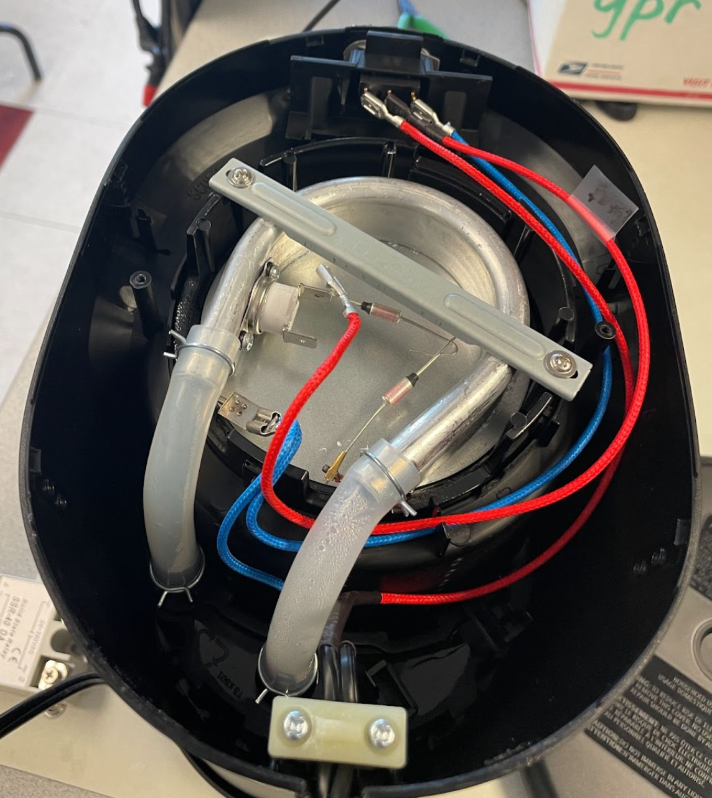
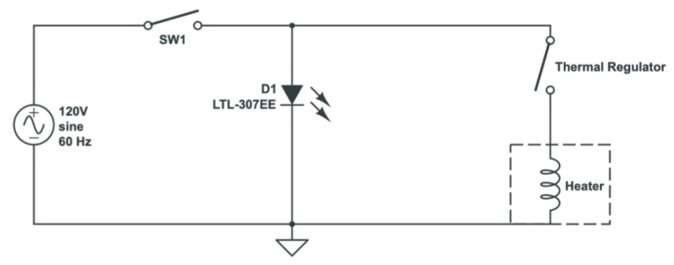

We hacked a Mr. Coffee machine with a Raspberry Pi and made a latte.

# Introduction & Motivation

So Anya is an avid coffee drinker and for her birthday she received an [Ember Travel Mug](https://ember.com/products/ember-travel-mug-2){:target="_blank"} that was temperature controlled. The mug is pretty unique in the sense that it allows the user to set an exact drinking temperature for whatever fluid they store inside the mug. So this inspired us to think bigger and create our very own temperature regulated coffee maker with “latte” abilities. This project really pushed us outside of our comfort zone and forced us to use an ample amount of the electrical engineering and prototyping skills we had picked up over the course of our time here at Cornell. 

View the demo video below to see the final product.

<iframe width="720" height="408" src="https://youtube.com/embed/HrVmi3yRgPc"></iframe>

# Setup

## Pre-existing System

To kick-off the project, we took apart the coffee machine and examined the circuitry to better understand the connections of the regular system and how it worked. The coffee machine is made up of 5 main elements:

* Switch
* Resistive Heating Element
* Thermal regulator 
* Water Tube 
* Reservoir

The system works in the following manner. First, water is poured into the reservoir and fills up the internal water tube that runs parallel to the heating element. Once the switch is flipped to make an electrical connection for current to flow through the system, the resistive heating element gets hot. The water in the heated tubing starts boiling, which forms air bubbles that rise up through the tubing and force drops of water upwards and out of the showerhead where the water is dripped over the coffee grounds and passes through to the coffee pot. As the heating element gets hotter and hotter due to the current running through it, the thermal sensor regulates the heat and caps the temperature at 180 degrees. Overtime, coffee is made as the air bubbles continue pushing the remaining water out of the tubing and into the grinds

Shown below is the actual wiring of the machine and its corresponding circuit schematic that better illustrates the connections that allow the coffee maker to do its function.

## Modifying the system

Upon understanding the pre-existing connections, we found the perfect spot to intercept the current wiring and insert our controller. This insertion happened between the internal thermal regulator and the resistive heating element. To hack the system we used a G5LE-1 single pole double throw relay rated at 10A, 120VAC and 3VDC for the relay coil, and a DS18B20 waterproof temperature sensor with an operating temperature ranging from -10°C to +85°C. Before hooking up all the components, we took an incremental approach to make sure that all the subcomponents work well and more importantly understand how the components worked individually.

### Understanding the Relay

Given that the relay was practically the crux of the hardware system of the redesigned coffee machine, we first tested the relay to understand how it worked. As the name indicates, this is a SPDT architecture, which means that the middle terminal can make different electrical connections upon switching. Shown below is the physical structure of the relay and its corresponding circuitry. During the first attempt of getting the relay working we used LED lights (a low current load) to test it out. 

<iframe width="720" height="408" src="https://youtube.com/embed/fjFVEP5lZts"></iframe>

In the initial attempt we assumed (just based off physical observation and not the facts) that the top 3 pins were the middle terminals and the two other pins that the relay switched between upon receiving a high or low signal. Thus, we connected pin 3 of the relay to ground, pin 4 of the relay to a Raspberry Pi GPIO pin, pin 2 to 3v3, the LED anode to pin 1 of the relay, and left pin 5 unconnected. We then toggled the GPIO pin on pin 4 of the relay HIGH and LOW every 2 seconds and the LED was blinking at the same frequency and so we concluded we knew how the relay worked (Or so we thought... stay tuned for more!). With this configuration, we transferred the relay over to the coffee machine and connected it in the same manner with pin 4 going to the Pi and pin 3 to the GND of the Pi. Without running any program on the Pi yet and upon plugging in the coffee machine to the wall outlet, sparks flew out of the breadboard, a transistor exploded, a diode was dead, and a Raspberry Pi was sent to the grave. In fact any component attached to Pi was annihilated. Immediately, we unplugged the coffee machine from the wall and started pondering what just happened. 

__What Just Happened?__

Obviously the wiring of our first attempt was just absolutely wrong and dangerous. Although our initial configuration seemingly “worked” the first time around, the reason why it appeared correct was that pin 1 and pin 4 were normally connected. This means that in the relay’s idle state pin 1 is always connected to pin 4 unless the electromagnetic coil is energized enough to toggle the connection from pin 1 to pin 4. Thus when we connected a GPIO pin to pin4 of the relay and toggle the pin HIGH and low we were directly feeding 3v3 to the anode of the LED instead of properly using the relay coil to switch the anode from unconnected to 3v3. When transferred over to the coffee maker, we essentially connected a 120V right to a GPIO pin of the RPi via the breadboard–which caused the sparks– and destroyed the Raspberry Pi machine.

### The Correct Way
To implement the relay connections properly, pin 1 of the Relay should’ve been connected to the Anode of the LED and since pin 1 is normally connected to pin 4, we should have connected pin 4 to 3v3. The GPIO and GND connection should’ve been across pins 2 & 5 so as to energize the electromagnetic coil to do the switching for us and lastly Pin 3 should’ve been left unconnected. In the same manner, with a coffee machine, the GPIO and GND pins should have been tied across pins 2&5 of the relay. Since, we want a normally open configuration of the relay for safety (especially after what happened) Pin 1 should’ve been connected to one part of the intercepted wire carrying 120V and pin 3 should have been connected to the other part of the 120V wire. So in the relay’s idle state, there would be no electrical connection made between the two 120V wires until the signal was given by the RPi

## Let’s Resume
Now that we realized our mistake, we got another raspberry pi and configured the relay correctly. Yet, we ran into another problem that stumped us for quite a while. Ahead of time, we knew that the raspberry pi could not supply enough current out of its GPIO pins to energize the electromagnetic coils of the relay and so we used a transistor-diode with a current-limiting resistor configuration (See Fig. X) that would typically support a sufficient current to perform the switching. However, to our surprise, even that set-up failed to do the job. We found out that with our latest set-up, the current-limiting resistor was not only inhibiting the current at the base of the transistor but also it inhibited the required current needed to flow across from the source to the drain to energize the electromagnetic coil. This limited current from the source to the drain is due to the fact that the current across the source and drain is essentially proportional to the current at base with a multiplicative factor also known as β or the gain of the transistor. To fix this, we had two options:

*1) Remove the current-limiting resistor at the base of the transistor and just feed the GPIO pin right in
*2) Implement a Darlington configuration (Shown below fig for Darlington) which would boost the gain to be the product of individual gains of both transistors (transforming the original gain from a relative magnitude of 102 to 103)

We decided to go with the Darlington set-up as it would allow us to insert a current-limiting resistor at the base and assure us of a high enough gain to enable stable and reliable switching of the relay at our will. With the above issues handled the relay was now up and running, enabling us to switch on and off the coffee maker.

// Add fig X used above
// Add fig. for Darlington

#Understanding the Thermometer
As mentioned above, we used a DS18B20 waterproof thermometer, which allowed us to read the temperature of the fluid that the thermometer was immersed in. This device communicates over a 1-wire interface which means that it only requires one data line and ground for communication with the Raspberry pi. Additionally, this also means that the thermometer can extract power directly from the data line which removes the requirement of an external power supply. Although the module appeared to have three lines (VDD, Data, & GND), if you examine the module PCB carefully, you will notice that VDD and Data are tied together via a 4.7KΩ resistor. Nonetheless, to interface with the thermometer, we enabled the 1-wire interface on the configuration settings on the Pi, modified the config.txt file in the boot directory of the Pi to include the GPIO pin that was being used on the data line for the 1-wire interface, and installed package called W1thermsensor to get the readings of the thermometer.

// Insert Thermometer Module Picture
##MVP (Minimum Viable Product)
With the thermometer module and the relay now working individually, we could now integrate the two devices together to now create a temperature controlled coffee maker. In short, the thermometer could now signal to the relay when switch on and shut-off based on the temperature readings it’s getting. This current system would be enough to accomplish the original goals we set out to achieve at the beginning of this project.

# Software aka GUI
While we had this SNAFU going on, we didn’t want to be held back and continued working on our GUI that the user would be interacting with. 

## 1 Latte Coming Right Up !
Since the MVP was finished and we had a bit more time on our hands, we decided to add a Latte feature to our coffee maker. For those of you who don’t know (a.k.a Chidera), this would essentially be coffee with milk. To automate the pouring of Milk into our coffee, we quickly assembled a makeshift turbine-type electric pump with a bottle cap, a lid, two tubes, 3 small acrylic rectangle cut-outs, and a DC motor. The way the system works is that the lid (which covers the bottle cap and has a drilled hole in the center) is connected to a fluid source (e.g a bottle of water) via a plastic tubing, then as the fluid flows from the source to the lid opening within the tubing, the fluid enters the bottle cap. Within the bottle cap lies two holes: one on the side of the bottle cap and one on the base. The hole on the base serves as the insertion point for the DC motor and the hole on the side supports another plastic tubing through which the incoming fluid (at the lid-bottle cap interface ) is pumped out to and the plastic tubing route guides the pumped fluid to its destination. The three small acrylic rectangles are connected to the motor equidistantly, and form the turbine formation that aids in pumping the fluid out. In a similar manner as with the relay, the leads of the pump were connected in parallel with the diode and connected between 5V and the source of the transistor. The diode is used to protect against any stray return currents from inductive motor load to the pi and the transistor yields the necessary current for the motors to function. In this situation a motor driver is not needed because we don’t really care about the direction the motor is spinning in this setup. So with all hardware in place, as the motor spins the ‘turbine,’ the fluid is carried out by the turbines from the source and into the destination. Nonetheless, once this electric pump was finished, we integrated it into our existing MVP and introduced Latte capabilities into our hacked temperature - controlled coffee maker

// Add a picture of the Electric Pump here 

#
#Sad but True Realization by Chidera
As I’m writing this paper I just realized that if I had plugged out the connections from pin4 and pin3 of the relay from the breadboard first and not the wall, I would have been directly exposed to 120V and I might not be here writing this final report. I just wanna thank God that I did not go out like that.
